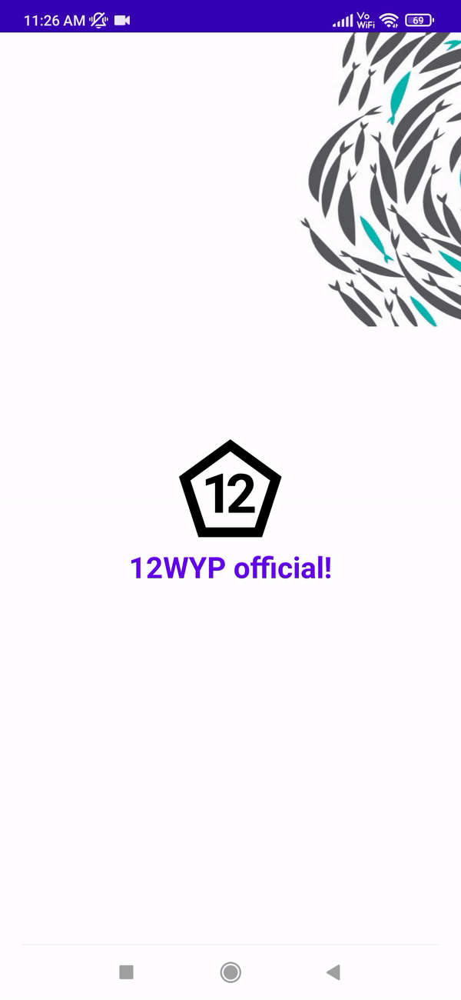
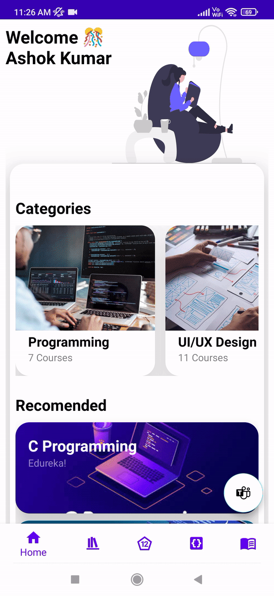
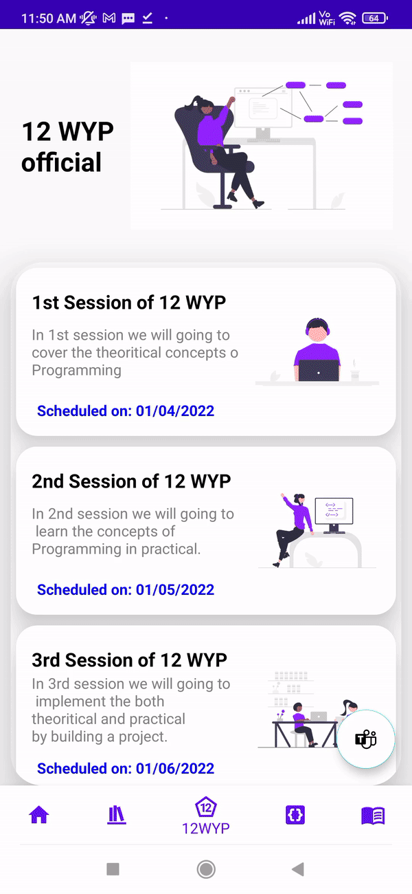

# Online-learning-App
An online learning Android application project for students to learn different programming courses  both
theoretically and practically with in application and to track their progress. I builded this Android Application using **Android IDE**.

**Language used:**
  I used Java programming language to build this project.

**UI design:**
 XML is used to create good interactive User interface and **UI designer App** helped me to design fastly.

